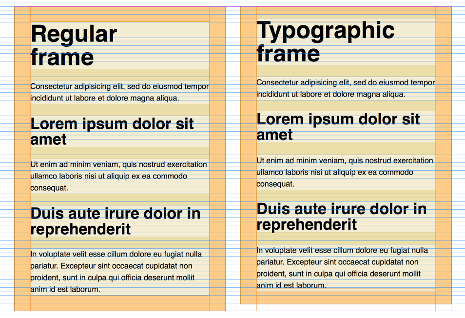

# TypographiCSS

Typographically accurate text in CSS



[See demo](https://attitude.github.io/typographicss/)

## Usage

```less
.typographicss-mixin(
    16, // Font size in points
    24, // Line height in points
    24, // Margin before
    24, // Margin after
    16, // Font-size base for EMs calculations
    70  // Cap height of the specific font; 80 is default
);
```

## More reading

[Designing a perfect text frame in CSS on Medium](https://medium.com/@martin_adamko/designing-a-perfect-text-frame-in-css-cfa8dc843867)
